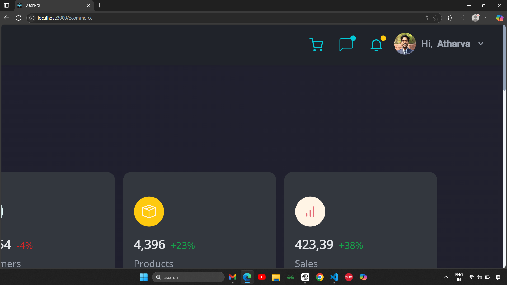
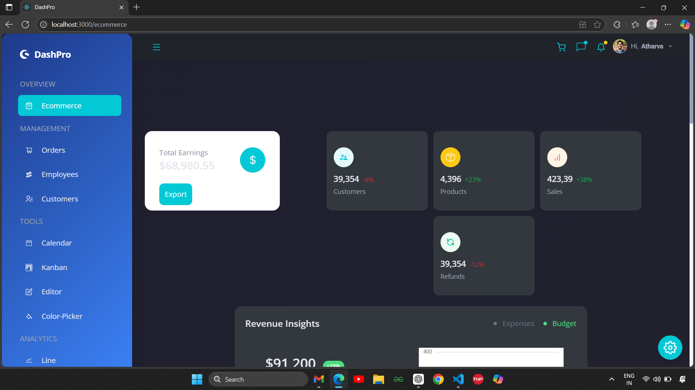
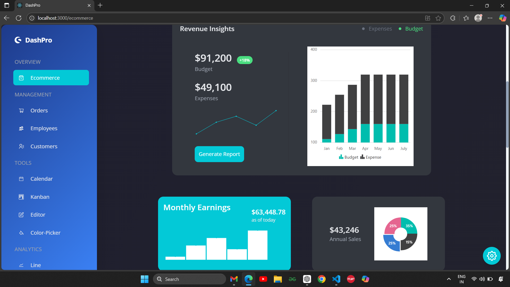
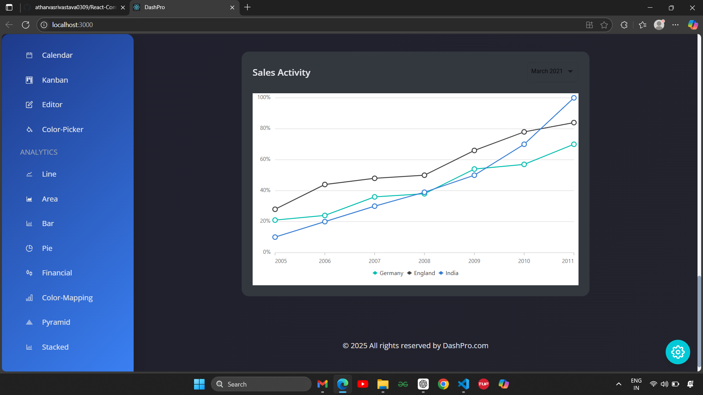
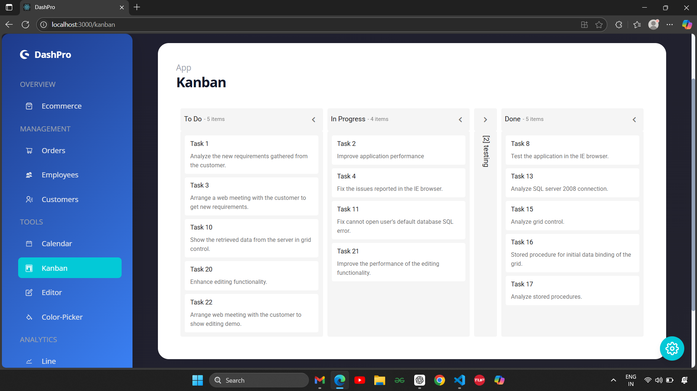

# 🚀 DashPro – React Admin Dashboard

**DashPro** is a modern, customizable, and responsive React Admin Dashboard built using **Tailwind CSS**, **Syncfusion Components**, and **React Router**.  
Designed for data-rich interfaces, internal tools, and analytics platforms.

---

## 📸 Screenshots

### 👤 User Profile Interface


### 🏠 Dashboard Main Interface


### 📊 Analytical Charts (Line, Area, Bar, Pie, etc.)


### 📈 Sales Activity View with Footer


### 🗂️ Kanban Board View


---

## ✨ Key Features

- 🌙 Dark Mode
- 🧠 Smart Sidebar Navigation
- 🧾 Pages like Orders, Customers, Employees, User Profile
- 📅 Calendar, Kanban, Editor, and Color Picker
- 📊 Fully Integrated Charts (Line, Area, Pie, Bar, Pyramid)
- 🎨 Theme Customizer & Color Switching
- 📱 Mobile-Friendly & Responsive
- ⚡ Blazing-fast Vite + React Setup

---

## 🛠️ Tech Stack

- **React JS**
- **Tailwind CSS**
- **Syncfusion React Components**
- **React Router v6**
- **React Icons**
- **Vite**

---

## 📁 Folder Structure

```

DashPro/
├── public/
│   ├── index.html
│   └── favicon.ico
├── src/
│   ├── components/       # Navbar, Sidebar, Charts, etc.
│   ├── pages/            # Page Components (Orders, Kanban, etc.)
│   ├── data/             # Static Data & Dummy Content
│   ├── contexts/         # Context API (Theme, State)
│   ├── App.js
│   ├── App.css
│   └── index.js

````

---

## 🙌 Acknowledgments

* [Syncfusion React Components](https://www.syncfusion.com/react-components)
* [React Icons](https://react-icons.github.io/react-icons/)
* [Tailwind CSS](https://tailwindcss.com/)
* [Vite](https://vitejs.dev/)

---

## 💡 Author

Made with ❤️ by **Atharva Srivastava**
